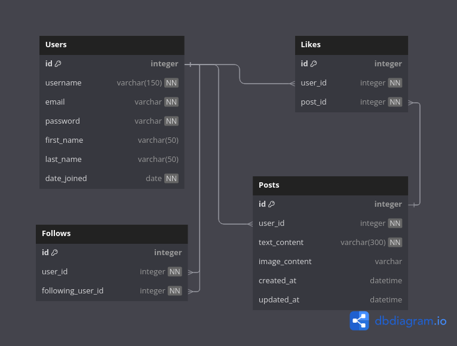

# Mini Twitter - B2BIT

A REST API for a simple social media platform

## Technologies used

* Python 3.13
* Poetry
* Django
* Django Rest Framewok
* Django Rest Framework
* PostgreSQL
* drf-spetacular (Swagger, Redoc)
* Docker

## How to run the project

1. Clone the repository
```
git clone https://github.com/arthurcostaa/minitwitter_b2bit.git
cd minitwitter_b2bit
```

2. Install the dependencies
```
poetry install
```

3. Copy .env.example to .env and set the environment variables
```
cp .env.example .env
```

4. Run the migrations
```
docker compose run web python manage.py migrate
```

5. Run the project with Docker Compose
```
docker compose up --build
```

6. Access the API at `http://localhost:8000/`

## Endpoints

### Docs

* `/swagger`: for interactive API documentation
* `/redoc/`: for API endpoint documentation

### Authentication

* `POST /auth/token/`: get access and refresh token
* `POST /auth/token/refresh/`: refresh access token

### Users

* `POST /accounts/users/`: create new user
* `GET /accounts/users/`: get all users
* `GET /accounts/users/{id}/`: get user by id
* `PUT /accounts/users/{id}/`: update user
* `PATCH /accounts/users/{id}/`: partially update user
* `DELETE /accounts/users/{id}/`: delete user
* `POST /accounts/users/{id}/follow/`: follow user
* `DELETE /accounts/users/{id}/follow/`: unfollow user

### Posts

* `GET /posts/`: get all posts
* `POST /posts/`: create new post
* `GET /posts/{id}/`: get post by id
* `PUT /posts/{id}/`: update post
* `PATCH /posts/{id}/`: partially update post
* `DELETE /posts/{id}/`: delete post
* `POST /posts/{id}/like/`: like post
* `DELETE /posts/{id}/like/`: remove like from post
* `GET /posts/feed/`: get posts from followed users

## Entity-Relationship diagram



* `Users` has a many-to-many relationship with `Likes`
* `Users` has a many-to-many relationship with `Follows`
* `Users` has a one-to-many relationship with `Posts`
* `Posts` has a one-to-many relationship with `Likes`